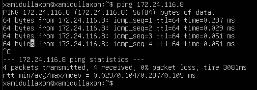
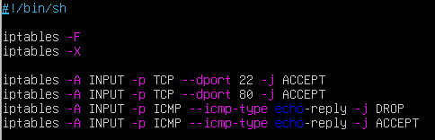
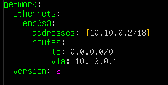

## Part 1: `ipcalc` tool

### 1.1 Networking and Masks
1. **network address of `192.176.38.54/13`**
    ```sh
    ipcal 192.167.38.54/13
    ```
    - **Address:**        `192.167.38.54`          11000000.10100 111.00100110.00110110
    - **Netmask:**        `255.248.0.0 = 13`       11111111.11111 000.00000000.00000000 
    - **Wildcard:**       `0.7.255.255`            00000000.00000 111.11111111.11111111 
    - **Network:**        `192.160.0.0/13`         11000000.10100 000.00000000.00000000
    - **HostMin:**        `192.160.0.1`            11000000.10100 000.00000000.00000001
    - **HostMax:**        `192.167.255.254`        11000000.10100 111.11111111.11111110
    - **Broadcast:**      `192.167.255.255`        11000000.10100 111.11111111.11111111
    - **Hosts/Net:**      `524286`                 Class C

2. **conversion of the mask `255.255.255.0`**
    - **Binary:** `11111111.11111111.11111111.00000000`
    - **Prefix:** `/24` (bu 24 ta 1 bitdan iborat binar shakl)
3. **`/15` to normal and binary**
    - **Normal** `255.254.0.0` 
    - **Binary** `11111111.11111110.00000000.00000000`
4. **`11111111.11111111.11111111.11110000` to normal and prefix**
    - **Normal:** `255.255.255.240`
    - **Prefiks:** `/28` (bu 28 ta 1 bitdan iborat binar shakl)

5. **minimum and maximum host in 12.167.38.4**
    ```sh
    ipcalc 12.167.38.4/8
    ```
    - **Address:** `12.167.38.4` 00001100. 10100111.00100110.00000100
    - **Netmask:** `255.0.0.0 = 8` 11111111. 00000000.00000000.00000000
    - **Wildcard:** `0.255.255.255`00000000. 11111111.11111111.11111111
    - **Network:** `12.0.0.0/8` 00001100. 00000000.00000000.00000000
    - **HostMin:** `12.0.0.1` 00001100. 00000000.00000000.00000001
    - **HostMax:** `12.255.255.254` 00001100. 11111111.11111111.11111110
    - **Broadcast:** `12.255.255.255` 00001100. 11111111.11111111.11111111
    - **Hosts/Net:** `16777214` Class A

6. **`11111111.11111111.00000000.00000000 (/16)`**
    ```sh
    ipcalc 12.167.38.4/16
    ```
    - **Address:** `12.167.38.4` 00001100.10100111. 00100110.00000100
    - **Netmask:** `255.0.0.0 = 16` 11111111.11111111. 00000000.00000000
    - **Wildcard:** `0.0.255.255`00000000.00000000. 11111111.11111111
    - **Network:** `12.167.0.0/16` 00001100.10100111. 00000000.00000000
    - **HostMin:** `12.167.0.1` 00001100.10100111. 00000000.00000001
    - **HostMax:** `12.167.255.254` 00001100.10100111. 11111111.11111110
    - **Broadcast:** `12.167.255.255` 00001100.10100111. 11111111.11111111
    - **Hosts/Net:** `65534` Class A

7. **`255.255.254.0 (/23)`**
    ```sh
    ipcalc 12.167.38.4/23
    ```
    - **Address:** `12.167.38.4` 00001100.10100111.0010011 0.00000100
    - **Netmask:** `255.0.0.0 = 23` 11111111.11111111.1111111 0.00000000
    - **Wildcard:** `0.0.1.255` 00000000.00000000.0000000 1.1111111
    - **Network:** `12.167.38.0/23` 00001100.10100111.0010011 0.00000000
    - **HostMin:** `12.167.38.1` 00001100.10100111.0010011 0.00000001
    - **HostMax:** `12.167.39.254` 00001100.10100111.0010011 1.11111110
    - **Broadcast:** `12.167.39.255` 00001100.10100111.0010011 1.11111111
    - **Hosts/Net:** `510` Class A

8. **minimum and maximum host in 12.167.38.4**
    ```sh
    ipcalc 12.167.38.4/4
    ```
    - **Address:** `12.167.38.4` 0000 1100.10100111.00100110.00000100
    - **Netmask:** `240.0.0.0 = 4` 1111 0000.00000000.00000000.00000000 
    - **Wildcard:** `15.255.255.255`0000 1111.11111111.11111111.11111111
    - **Network:** `0.0.0.0/4` 0000 0000.00000000.00000000.00000000
    - **HostMin:** `0.0.0.1` 0000 0000.00000000.00000000.00000001
    - **HostMax:** `15.255.255.254` 0000 1111.11111111.11111111.11111110
    - **Broadcast:** `15.255.255.255` 0000 1111.11111111.11111111.11111111 
    - **Hosts/Net:** `268435454` Class A, In Part Private Internet    


### 1.2 localhost
1. **localhostdagi ilovaga kirish mumkin bo'lgan IP manzillar:**
    - **194.34.23.100:** (localhost emas) 
    - **127.0.0.2:** (localhost) 
    - **127.1.0.1:** (localhost) 
    - **128.0.0.1:** (localhost emas)


### 1.3 Network ranges and segments

1. **Public IPs:**
    - 134.43.0.2
    - 172.0.2.1
    - 192.172.0.1
    - 172.68.0.2
    - 192.169.168.1

2. **Private IPs:**
    - 10.0.0.45
    - 192.168.4.2
    - 172.20.250.4
    - 172.16.255.255
    - 10.10.10.10

3. **IP addresses are possible for `10.10.0.0/18` network:**
    - `10.10.0.2`
    - `10.10.10.10`
    

## Part 2: Static routing between two machines
1. **`ip` command**
    ```sh
    ip a
    ```
    - screenshot 
    - screenshot 

2.  **Added `192.168.100.10/16` and `172.24.116.8/12`**
    ```sh
    sudo nano /etc/netplan/00-installer-config.yaml
    ```
    - screenshots 
    - screenshots 
3.  **`netplan apply` restarted the network service**
    ```sh
    sudo netplan apply
    ```
    - screenshots 
    - screenshots 
    
### 2.1 Adding a static route manually
1. **`ip r add` command**
    ```sh
    sudo ip r addr add 172.24.116.8/12 dev enp0s3
    ping 172.24.116.8
    ```
    - screenshots 
    ```sh
    sudo ip r addr add 192.168.100.10/16 dev enp0s3
    ping 192.168.100.10
    ```
    - screenshots     


### 2.2 Adding a static route with saving
1. **Statik marshrut qo'shish**
    - from ws1 to ws2:
    ```sh
    sudo ip route add 172.24.116.8 via 192.168.100.10 dev enp0s3
    ```
    - screenshots 
    ```sh
    ping 172.24.116.8
    ```
    - screenshot  
    
    - from ws2 to ws1:
    ```sh
    sudo ip route add 192.168.100.10 via 172.24.116.8 dev enp0s3
    ```
    - screenshots 
    ```sh
    ping 192.168.100.10
    ```    
    - screenshot 
    

## Part 3: iperf3 utility
### **3.1 Connection speed**

1. **8 Mbps to MB/s, 100 MB/s to Kbps, 1 Gbps to Mbps:**
    - 8 Mbps = 1 MB/s
    - 100 MB/s = 819200 Kbps
    - 1 Gbps = 1000 Mbps

### **3.2 iperf3 utility**
    ```sh
    sudo apt update
    sudo apt install iperf3
    ```
1. **`ws1` da server ishga tushirish**
    ```sh
    iperf -s
    ```
    - `ws2` clientni ishga tushirish
    ```sh
    iperf3 -c 192.168.100.10
    ```
    - screenshot: 

2. **`ws2` da server ishga tushirish**
    ```sh
    iperf -s
    ```
    - `ws1` clientni ishga tushirish
    ```sh
    iperf3 -c 172.24.116.8
    ```
    - screenshot: 
    

## Part 4: Nerwork firewall
### **4.1 iptables utility**
#### **ws1:**
1. **`/etc/firewall` ws1:** 
    - screenshot 

2. **`chmod +x /etc/firewall.sh` and `/etc/firewall.sh`**
    - screenshot 

#### **ws2:**
1. **`/etc/firewall` ws1:** 
    - screenshot 

2. **`chmod +x /etc/firewall.sh` and `/etc/firewall.sh`**
    - screenshot 

    - ws1: DROP qoidasi asosiy qoidalar sifatida ishlatilgan, 
    bu esa har qanday tarmoq trafigini dastlab cheklaydi, 
    keyin kerakli portlar ochiladi.
    - ws2: ACCEPT qoidasi asosiy qoidalar sifatida ishlatilgan, 
    bu barcha trafikni dastlab ruxsat beradi, keyin kerakli trafik 
    cheklab boriladi.

### **4.2 utility nmap**
#### **ws1:**
1. **`ping` and `nmap`** 
    - screenshot 

#### **ws2:**
1. **`ping`** 
    - screenshot 


## Part 5: Static network routing
### **5.1 Configurations of machine addresses `ws11`, `ws21`, `ws22`, `r1`, `r2`**
1. **etc/netplan/00-installer-config.yaml**  
    - `ws11`
    - screenshot 
    - `ws21`
    - screenshot 
    - `ws22`
    - screenshot 
    - `r1`
    - screenshot 
    - `r2`
    - screenshot  

2. **`ip -4 a`**
    - `ws11`
    - screenshot 
    - `ws21`
    - screenshot 
    - `ws22`
    - screenshot 
    - `r1`
    - screenshot 
    - `r2`
    - screenshot  

3. **Ping**
    - `from ws21 to ws22`
    ```sh
    sudo ip addr add 10.20.0.20/26 dev enp0s3
    ```
    - screecshot 
    - `from ws11 to r1`
    ```sh
    sudo ip addr add 10.10.0.1/18 dev enp0s3
    ```
    - screenshot 


### **5.2 Enabling IP forwarding**
1. **`sysctl -w net.ipv4.ip_forward=1`**
    - `r1`
    - screecshot 
    - `r2`
    - screecshot 

2. **`/etc/sysctl.conf`**
    - `r1`
    ```sh
    sudo nano /etc/sysctl.conf
    ```
    - screecshot 
    - `r2`
    ```sh
    sudo nano /etc/sysctl.conf
    ```
    - screecshot 

### **5.3 Default route configuration**
1. **`etc/netplan/00-installer-config.yaml`**
    - `ws11`
    - screecshot 
    - `ws21`
    - screecshot 
    - `ws22`
    - screecshot 

2. **`ip r`**
    - `ws11`
    - screecshot 
    - `ws21`
    - screecshot 
    - `ws22`
    - screecshot 
                        
3. **`tcpdump -tn -i eth0` command**
    - `r2`
    - screecshot  ----------------------------------
    - `ws11`
    - screecshot ----------------------------------

### **5.4 Adding static routes**
1. **added static routes**
    - `r1`
    - screecshot 
    - `r2`
    - screecshot 

2. **`ip r`**
    - `r1`
    - screecshot 
    - `r2`
    - screecshot 

3. **`ip r list 10.10.0.0/[netmask]` and `ip r list 0.0.0.0/0`**
    ```sh
    ip r list 10.10.0.0/18
    ip r list 0.0.0.0/0
    ```
    - screecshot 
    - 10.10.0.0/18 uchun 0.0.0.0/0 dan boshqa marshrut tanlangan, 
    chunki u tarmoq manzili bo'lib, unga shlyuzsiz to'g'ridan to'g'ri kirish mumkin.

### **5.5 Making a router list**
1. **`tcpdump -tnv -i eth0` dump command on r11**
    ```sh
    sudo tcpdump -tnv -i eth0
    traceroute 10.20.0.10
    ```
    - screenshot 
    - screenshot 
    - TTL mexanizmi:
        Har bir paketda TTL (Time to Live) qiymati bor. Dastlabki qiymati odatda 1 dan boshlanadi va har bir routerdan o‘tishda 1 ga kamayadi.
        TTL 0 ga yetganda, router ICMP xato xabari ("Time Exceeded") qaytaradi.
    - Routerlarni aniqlash:
        Traceroute birinchi paketni TTL = 1 qiymati bilan yuboradi. Paket birinchi routerga yetib borganda, router uni to‘xtatadi va xato xabari qaytaradi. Shu tariqa, birinchi router aniqlanadi.
        Ikkinchi paket TTL = 2 bilan yuboriladi, u keyingi routerga yetib boradi va jarayon takrorlanadi.
    - Traceroute natijasi:
        Har bir router xato xabarida o‘zining IP-manzilini yuboradi. Shu orqali barcha routerlarning manzillari va har bir hop uchun kechikish vaqti (ms) hisoblab chiqiladi.


### **5.6 Using ICMP protocol in routing**
1. **`r1`**
    ```sh
    tcpdump -n -i eth0 icmp
    ```
    - screenshot 
    - screenshot 

## Part 6: Dynamic IP configuration using DHCP
1. **`/etc/dhcp/dhcpd.conf file:`**
    - screenshot 

2. **`nameserver 8.8.8.8`**
    - screenshot 

3. **`systemctl restart isc-dhcp-server`**
    - screenshot 

4. **`etc/netplan/00-installer-config.yaml:`**
    - screenshot 

5. **`ws21`**
    - screenshot 
6. **`DHCP`**
    - Diapazon: DHCP serveri belgilashi mumkin bo'lgan IP manzillar oralig'ini belgilaydi.
    Routerlar: Mijozlar uchun standart shlyuzni belgilaydi.
    Domen nomi-serverlari: Mijozlar uchun DNS serverini belgilaydi.
    Ruxsat etilgan manzil: MAC manzili asosida mijozga statik IP-manzilni tayinlaydi.


## Part 7: NAT
1. **`/etc/apache2/ports.conf`**
    - screenshot 
    - screenshot 

2. **`service apache2 start`**
    - screenshot 
    - screenshot 

3. **`/etc/firewall.sh`**
    - screenshot 

4. **`ping` ws22 and r1**
    - screenshot 
    - screenshot 

5. **DONE**

6. **`DNAT`**
    ```sh
    sudo /etc/firewall.sh
    ```
    - screenshot 
    - screenshot 
    ```sh
    telnet 10.100.0.11 80
    ```
    - screenshot 

    ```sh
    telnet 10.100.0.12 8080
    ```
    - screenshot 


## Part 8: Introduction to SSH Tunnels
1. **`/etc/apache2/ports.conf`**
    - Apache veb-serverini ws22 da faqat localhost-da ishga tushirish:
    - screenshot 
    - ws21-dan ws22-da veb-serverga kirish uchun ws21-dan ws22-ga mahalliy TCP-ni yo'naltirishdan foydalanish:
    ```sh
    ssh -L 4242:localhost:80 10.20.0.20
    ```    
    - Mahalliy TCP-ni yo'naltirish uchun ssh -L local_port:destination:destination_port ssh_server_ip buyrug'idan foydalanishni tekshirish:
    ```sh
    telnet 127.0.0.1 8080
    ```
    - screenshot 
    - ws11-dan ws22-ga ws11-dan ws22-ga veb-serverga kirish uchun TCP-ni masofaviy yo'naltirishdan foydalanish:
    ```sh
    ssh -R 8080:localhost:80 10.20.0.20
    ```
    - Masofaviy TCP-ni yo'naltirish uchun ssh -R remote_port:destination:destination_port ssh_server_ip buyrug'idan foydalanishni tekshirish:
    ```sh
    telnet 127.0.0.1 8080
    ```
    - screenshot 